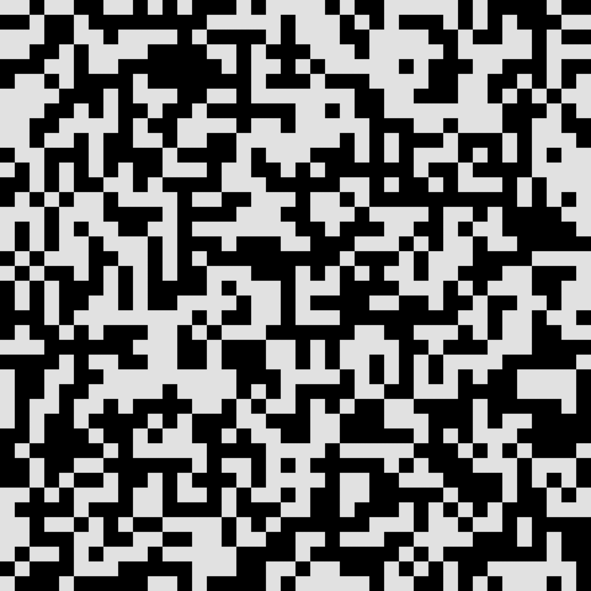
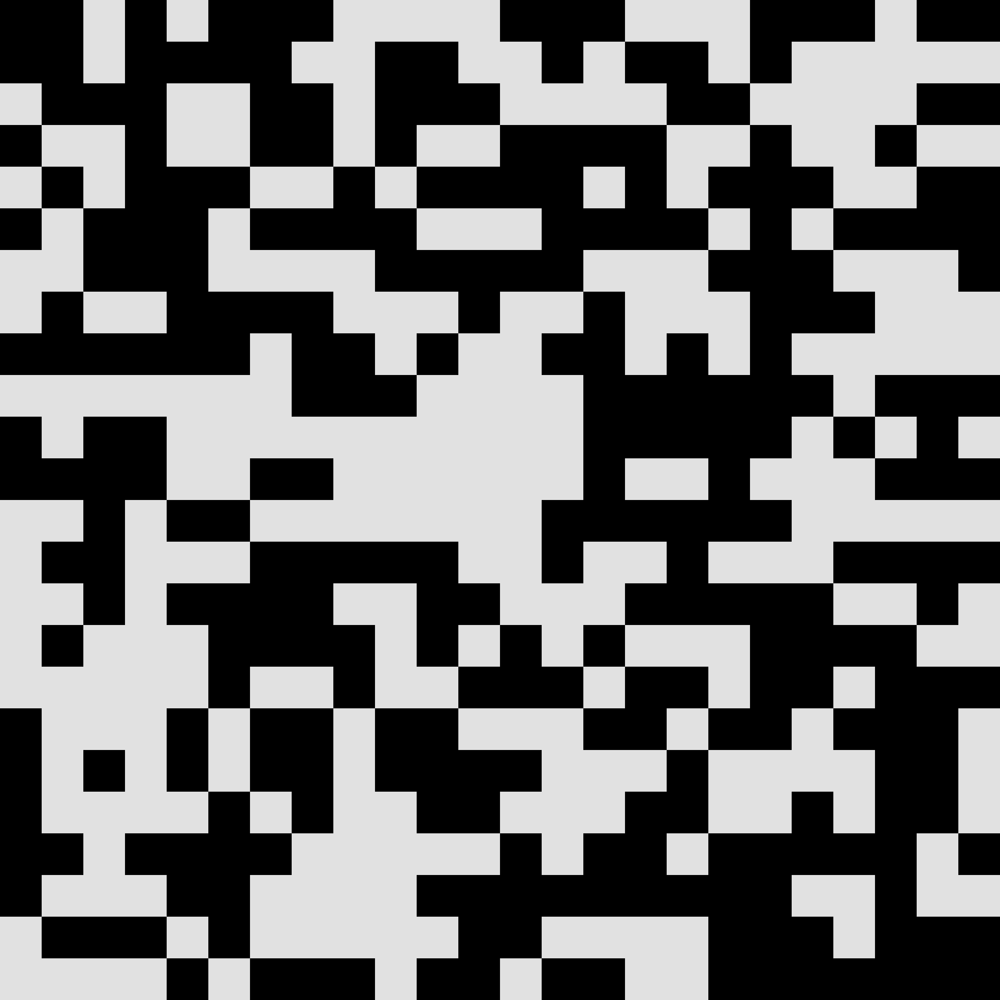
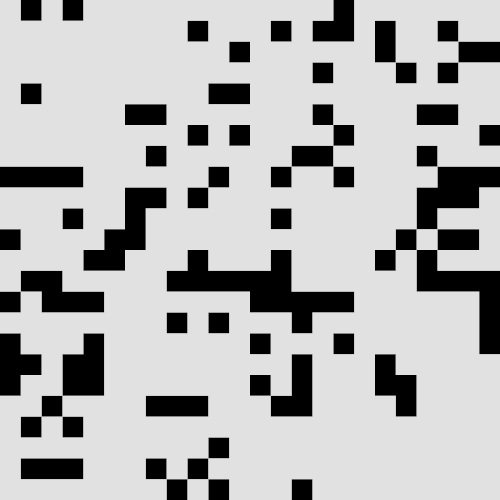

---

### Table of Contents
* [About](#about)
* [Motivation and project status](#motivation-and-project-status)
* [Technologies used](#technologies-used)
* [Requirements](#requirements)
* [Configuration](#configuration)
* [Setup and usage](#setup-and-usage)
* [Tests](#tests)
* [Generated images](#generated-images)
* [Licence](#licence)

---

### About

Game of Life is a cellular automaton. It is a zero-player game, meaning that its evolution is determined by its initial state, requiring no further input.

You can read more information on <a href="https://en.wikipedia.org/wiki/Conway%27s_Game_of_Life">wikipedia.</a>

The gif below was created from images genarated by the application. 




---

### Motivation and project status

Game of Life was created as my student project during the first year of studying Computer Science in collaboration with Bartosz Zdybel.

The project was completed successfully. 

Duration time: 26.02.2020 - 01.04.2020.

---

### Technologies used
* C;
* Make (Makefile);
* Vim.
---

### Requirements

To compile the game you need to have libpng and gcc compailer installed.
```bash
sudo apt install libpng-dev
sudo apt install gcc
```

---

### Configuration

To run the game need to upload the configuration file. You can use the exemplary files in game-of-life/config or create your own:

Examples:

```txt
15 X 15 MOOR NORMAL
000000000000000
000000000000000
011000000000000
000000000000000
010011000000000
001101101100000
110011111100000
010000010011010
010110010011111
001000000001000
000000000010111
000011100000011
001100010000011
001000000001000
000000000000000
```

```txt
15 x 15 MOOR RAND
```

```txt
6 X 13 NEUMANN NORMAL
101110
101110
101010
101100
101010
110110
011010
010110
101011
101010
001110
111111
110111
```

<a hreaf="https://en.wikipedia.org/wiki/Moore_neighborhood">MOOR</a> or <a href="https://en.wikipedia.org/wiki/Von_Neumann_neighborhood">NEUMANN</a> is a type of neighborhood.

---

### Setup and usage

1.  Clone this repository:

    ```bash
    git clone git@github.com:wysockif/game-of-life.git
    ```

2.  Change your directory to `game-of-life/app` and compile the game::

    ```bash
    make
    ```

3.  Run the application:
    
    * Help (-H):
    ```bash
    ./a.out -H
    ```

    * Step by step (-SBS):
    ```bash
    ./a.out path/to/config.txt -SBS
    ```
    
    * 10 iterations (-N): 
    ```bash
    ./a.out path/to/config.txt -N 10
    ```

    * Saving images (-PNG):
    ```bash
    ./a.out path/to/config.txt -N 10 -PNG
    ```
    
    
---

### Tests

1. Run tests:

    ```bash
    make test_X
    ```
    where X can be one of the module below:
    * movement;
    * input_file;
    * board;
    * control;
    * output_file;
    * png_drawing.
---

### Generated images

To generate images you need to add -PNG while running.






---

### License
Usage is provided under the [MIT License](http://opensource.org/licenses/mit-license.php). See LICENSE for the full details.
